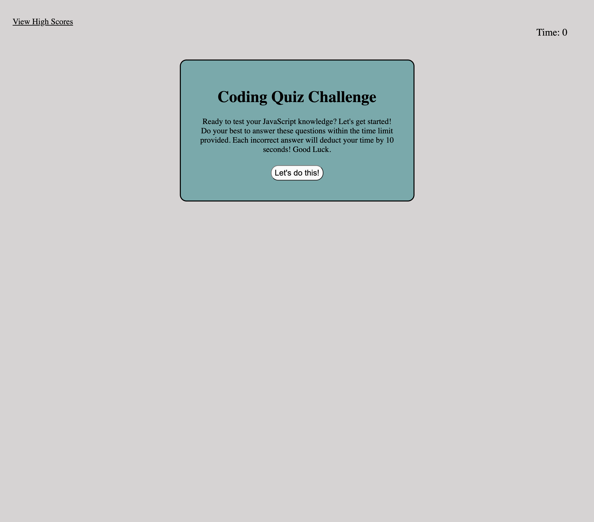

# Timed-Quiz

## Description
This quiz was created to test the user's knowledge of some basic JavaScript. It has given me the chance to work more on my JavaScript as well as the logic behind some of the methods and functions used. 

## How to Play
1. Click on "Let's do this!" button to activate the quiz.
2. Try to answer as many multiple choice questions as you can within time provided.
3. Each incorrect answer will deduct your time by 10. Your final score is based on time left on the timer.
4. Once done, enter your initials to save your score.

## Mock Up

## Link to Application
https://agrig33.github.io/timed-quiz/

## Link to Github Repository
https://github.com/Agrig33/timed-quiz

## References
https://www.w3schools.com/quiztest/quiztest.asp?qtest=JS

https://www.w3schools.com/js/js_if_else.asp